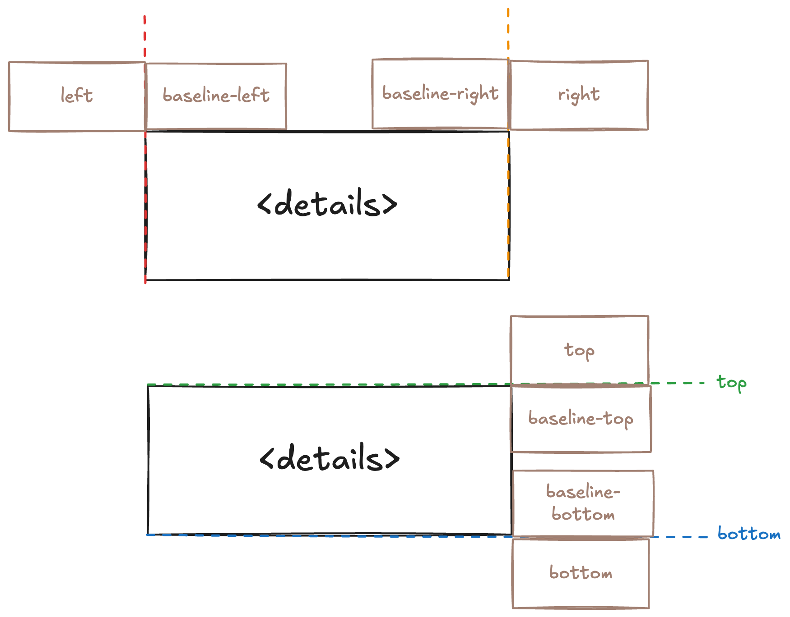

## Import

```css
@import "@webtui/css/components/popover.css";
```

## Usage

Add the `is-~="popover"` attribute to a `<details>` element to make it a popover

```html
<details is-="popover">
    <summary>Popover</summary>
    <div>Popover content</div>
</details>
```

The first child following the `<summary>` element is the popover content

### `position-`

Use the `position-` attribute to change the position of the popover

```html
<details is-~="popover" position-="top"></details>
<details is-~="popover" position-="left"></details>
<details is-~="popover" position-="bottom"></details>
<details is-~="popover" position-="right"></details>
```

Add two values to the `position-` attribute to change the x and y positioning of the popover content

```html
<details is-~="popover" position-="top left"></details>
<details is-~="popover" position-="right baseline-top"></details>
<details is-~="popover" position-="bottom baseline-left"></details>
```

The image below shows the values and positions that can be used in the `position-` property



#### Values

- `top`
- `bottom`
- `left`
- `right`
- `baseline-top`
- `baseline-bottom`
- `baseline-left`
- `baseline-right`

### Properties

- `--popover-backdrop-color`: The background color of the backdrop (transparent by default)
- `--popover-offset-x`: The horizontal offset of the popover
- `--popover-offset-y`: The vertical offset of the popover

```css
#my-custom-popover {
    --popover-backdrop-color: rgba(0, 0, 0, 0.5);
    --popover-offset-x: 1ch;
    --popover-offset-y: 1lh;
}
```

### Extending

To extend the Popover stylesheet, define a CSS rule on the `components` layer

```css
@layer components {
    details[is-~="popover"] {
        &[variant-="inverted"] {
            /* ... */
        }

        /* ... */
    }
}

## Scope

```css
details[is-~="popover"] { /* ... */ }
```
