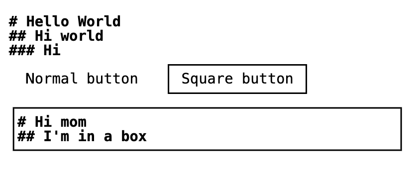

It is **highly recommended** that you use **CSS Imports** with **WebTUI**

It's _possible_ to use [ESM imports](#esm-imports) or [CDN imports](#cdn-imports)

WebTUI is a **Pure CSS Library** meaning you _will still have to write **some** CSS_

## Installation

Install the base WebTUI package with your preferred package manager

```bash
bun i @webtui/css
npm i @webtui/css
yarn add @webtui/css
pnpm install @webtui/css
```

In your global CSS file, define the order of layers using the `@layer` at-rule [[MDN Reference]](https://developer.mozilla.org/en-US/docs/Web/CSS/@layer) **before** importing the base stylesheet

```css
@layer base, utils, components;

@import "@webtui/css/base.css";
```

Import the desired utilities, components, and themes **after** importing the base stylesheet

```css
@layer base, utils, components;

@import "@webtui/css/base.css";

/* Utils */
@import "@webtui/css/utils/box.css"; /*[!code ++]*/

/* Components */
@import "@webtui/css/components/button.css"; /*[!code ++]*/
@import "@webtui/css/components/typography.css"; /*[!code ++]*/
```

Add some HTML

```html
<h1>Hello World</h1>
<h2>Hi world</h2>
<h3>Hi</h3>

<button>Normal button</button>

<button box-="square">Square button</button>

<div box-="square">
  <h1>Hi mom</h1>
  <h2>I'm in a box</h2>
</div>
```

You should see a significant upgrade from standard HTML styles



If you want to add a pre-built color theme, check out the [Plugins](/start/plugins) section

## ESM Imports

Stylesheets can be imported via ESM if your bundler supports it

```tsx
import "@webtui/css/components/button.css";

type Props = {
  /* ... */
};

export default function Button(props: Props) {
  return <button>{props.children}</button>;
}
```

## CDN Imports

Stylesheets can be imported with `<link>` served via CDN

```html
<link
  rel="stylesheet"
  href="https://cdn.jsdelivr.net/npm/@webtui/css/dist/base.css"
/>
```

To import a specific version, add `@<version>` to the CDN URL after `/@webtui/css`

```html
<link
  rel="stylesheet"
  href="https://cdn.jsdelivr.net/npm/@webtui/css@0.0.0/dist/base.css"
/>
```

Although not recommended, the latest version of WebTUI can be imported via the `@latest` tag

**Important:** You must define the order of layers **before** importing any styles from **WebTUI**

```html
<style>
  @layer base, utils, components;
</style>
<link
  rel="stylesheet"
  href="https://cdn.jsdelivr.net/npm/@webtui/css@0.0.0/dist/base.css"
/>
<link
  rel="stylesheet"
  href="https://cdn.jsdelivr.net/npm/@webtui/css@0.0.0/dist/components/button.css"
/>
<!-- ... -->
```

All available stylesheets on the CDN are viewable via [JSDelivr](https://cdn.jsdelivr.net/npm/@webtui/css@0.0.0/dist/)

## Full Library Import

Import the entire library by importing the package directly, **after** defining the order of layers

```css
@layer base, utils, components;

@import "@webtui/css";
```

ESM Imports are almost identical to CSS imports

```js
import "@webtui/css";
```

For the CDN, import `/dist/full.css` instead of the base path

```html
<link
  rel="stylesheet"
  href="https://cdn.jsdelivr.net/npm/@webtui/css/dist/full.css"
/>
```
